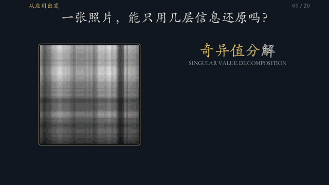
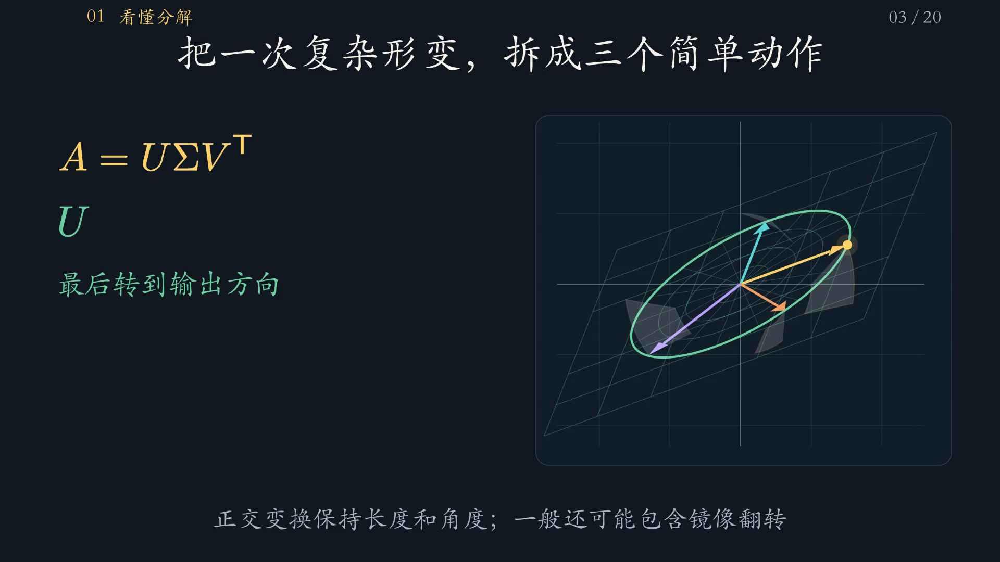

# 奇异值分解：从图像重建到完整证明

一部约 5 分钟的中文 Manim 科普动画。从一张照片的逐层重建开始，看清 SVD 为什么能把复杂矩阵拆成方向与拉伸。

*开场动图：保留更多奇异值，照片中的结构逐步出现。*

**[直接下载 1080P / 60 fps 成片](https://github.com/FTZ-OPUS/manim-svd-animation/raw/refs/heads/main/%E5%A5%87%E5%BC%82%E5%80%BC%E5%88%86%E8%A7%A3/%E5%A5%87%E5%BC%82%E5%80%BC%E5%88%86%E8%A7%A3%E7%A7%91%E6%99%AE%E5%8A%A8%E7%94%BB_1080P60.mp4)** · [源代码](奇异值分解/奇异值分解科普.py) · [制作与重渲染工作流](工作流.md) · [素材及来源](奇异值分解/素材/来源说明.md)

*视频截图：输入方向、拉伸倍率与输出方向在同一幅图中对应。*

视频还逐步证明特征值、奇异值和左右奇异向量之间的关系，最后展示图像压缩、PCA 和伪逆的应用。

源码、成片、素材、依赖和验收资料集中在 [`奇异值分解/`](奇异值分解/) 文件夹。原速视频约 18 MB，点击上方链接即可下载；GitHub 文件页对大视频不提供站内预览。仓库页面右上角的 **Code → Download ZIP** 可下载全部已发布文件。

参考了 [FTZ-OPUS/manim-10-tasks](https://github.com/FTZ-OPUS/manim-10-tasks) 的字体、配色和公式风格。图像是 NASA 公共领域照片，所有低秩重建均由 NumPy 实际计算。
